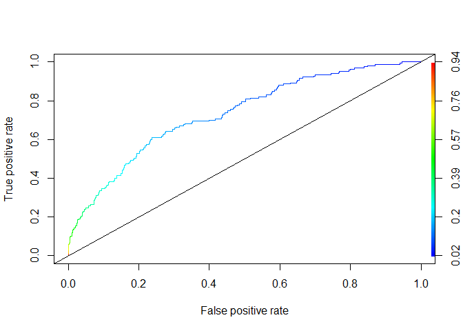

Heart Disease Predictions
================
Ran Meng
February 16, 2019

``` r
setwd("C:/Ran/Berkeley/IEOR/242/Applications in Data Analysis")
library(dplyr)
library(ggplot2)
library(GGally)
library(caTools)
library(ROCR)
library(MASS)
```

a:
--

i:

``` r
set.seed(144)
chd <- read.csv("framingham.csv")
split <- sample.split(chd$TenYearCHD, SplitRatio = 0.7)

train <- filter(chd, split == TRUE)
test <- filter(chd, split == FALSE)

LogModel <- glm(TenYearCHD ~ male + age + education + currentSmoker + cigsPerDay + 
                BPMeds + prevalentStroke + prevalentHyp + diabetes + totChol + sysBP    + diaBP + BMI   + heartRate +    glucose, data = train, family = "binomial")
summary(LogModel)
```

    ## 
    ## Call:
    ## glm(formula = TenYearCHD ~ male + age + education + currentSmoker + 
    ##     cigsPerDay + BPMeds + prevalentStroke + prevalentHyp + diabetes + 
    ##     totChol + sysBP + diaBP + BMI + heartRate + glucose, family = "binomial", 
    ##     data = train)
    ## 
    ## Deviance Residuals: 
    ##     Min       1Q   Median       3Q      Max  
    ## -1.5660  -0.5879  -0.4221  -0.2890   2.8298  
    ## 
    ## Coefficients:
    ##                                           Estimate Std. Error z value
    ## (Intercept)                             -8.495e+00  8.528e-01  -9.962
    ## male                                     4.292e-01  1.306e-01   3.285
    ## age                                      6.495e-02  7.964e-03   8.156
    ## educationHigh school/GED                -1.209e-01  2.131e-01  -0.567
    ## educationSome college/vocational school -7.719e-02  2.311e-01  -0.334
    ## educationSome high school                6.404e-02  1.970e-01   0.325
    ## currentSmoker                            1.033e-01  1.868e-01   0.553
    ## cigsPerDay                               1.739e-02  7.411e-03   2.346
    ## BPMeds                                  -1.072e-01  2.835e-01  -0.378
    ## prevalentStroke                          9.369e-01  5.912e-01   1.585
    ## prevalentHyp                             2.443e-01  1.691e-01   1.445
    ## diabetes                                -5.921e-03  3.903e-01  -0.015
    ## totChol                                  1.872e-03  1.351e-03   1.386
    ## sysBP                                    1.678e-02  4.791e-03   3.502
    ## diaBP                                   -7.463e-03  7.847e-03  -0.951
    ## BMI                                      4.455e-03  1.546e-02   0.288
    ## heartRate                               -8.383e-07  4.995e-03   0.000
    ## glucose                                  8.356e-03  2.721e-03   3.071
    ##                                         Pr(>|z|)    
    ## (Intercept)                              < 2e-16 ***
    ## male                                    0.001020 ** 
    ## age                                     3.47e-16 ***
    ## educationHigh school/GED                0.570495    
    ## educationSome college/vocational school 0.738329    
    ## educationSome high school               0.745147    
    ## currentSmoker                           0.580275    
    ## cigsPerDay                              0.018961 *  
    ## BPMeds                                  0.705326    
    ## prevalentStroke                         0.113042    
    ## prevalentHyp                            0.148444    
    ## diabetes                                0.987897    
    ## totChol                                 0.165826    
    ## sysBP                                   0.000462 ***
    ## diaBP                                   0.341558    
    ## BMI                                     0.773177    
    ## heartRate                               0.999866    
    ## glucose                                 0.002132 ** 
    ## ---
    ## Signif. codes:  0 '***' 0.001 '**' 0.01 '*' 0.05 '.' 0.1 ' ' 1
    ## 
    ## (Dispersion parameter for binomial family taken to be 1)
    ## 
    ##     Null deviance: 2185.3  on 2560  degrees of freedom
    ## Residual deviance: 1930.7  on 2543  degrees of freedom
    ## AIC: 1966.7
    ## 
    ## Number of Fisher Scoring iterations: 5

i:
Please refer to the handwritten solution above

ii: According to p- values, the most important risk factors are age and Systolic blood pressure(sysBP). By looking at the coefficient of sysBP, we can observe that an additional 1 unit in sysBP level will result in gaining 0.01678 unit of the log of patient's predicted odds. In other words, higher sysBP level contributes to higher predicted odds of patient according to the logistic model.

iii:
Based on the calculation, it is optimal to prescribe the meditation iff the patient's risk exceeds p = 0.16

iv:

``` r
predTestLog <- predict(LogModel, newdata=test, type="response")

# Confusion matricies based on decision tree threshold 
CM <- table(test$TenYearCHD, predTestLog > 0.16)
CM
```

    ##    
    ##     FALSE TRUE
    ##   0   637  293
    ##   1    56  111

Model's accuracy is 0.682 :

``` r
acc <-  (637 + 111)/nrow(test)
acc
```

    ## [1] 0.6818596

TPR = 0.665:

``` r
TPR <-   111/(56 + 111)
TPR
```

    ## [1] 0.6646707

FPR = 0.315:

``` r
FPR <-   293/(293 + 637)
FPR
```

    ## [1] 0.3150538

The accuracy (acc) of the model is the proportion of predictions that match with actual observations. The True Positive Rate (TPR) is the proportion of actual positives that are correctly identified as positive. In this case, it is the ratio of people who are predicted to get CHD and actually got CHD to all people who got CHD. The False Positive Rate (FPR) is the proportion of actual negatives that are incorrectly identified as positive. In this case, it is the ratio of people who are predicted to get CHD but did not actually get CHD to all people who did not get CHD.

v: Estimate assuming CHD outcomes not affected by treatment decision:
$$ E\[cost\] = \\frac{637}{1097}\\cdot 0 + \\frac {293}{1097}\\cdot 60000 + \\frac{56}{1097}\\cdot 500000 + \\frac{111}{1097}\\cdot 560000  = 98213.3 $$

However, the assumption that CHD outcomes in the test set are not affected by the treatment decision is not reasonable because the decision of prescribing the medication affects the probability of getting CHD. To take the treatment decision into account, we should divide the number of true positives in the confusion matrix by 4(since the probability of developing CHD after taking the medication is p/4). In other words, 3/4 of people from the original confusion matrix who were identified as "True Positive" will be in the group of "False Positive". Based on the calculations, the number of people who are predicted to get CHD and actually got CHD is 28, and the number of people who are predicted to get CHD but did not actually develop CHD is (293+111)-28 = 376.:
Estimate assuming CHD outcomes affected by treatment decision:
$$ E\[cost\] = \\frac{637}{1097}\\cdot 0 + \\frac {376}{1097}\\cdot 60000 + \\frac{56}{1097}\\cdot 500000 + \\frac{28}{1097}\\cdot 560000  = 60382.9 $$

vi: For baseline model that predicts no one is at high risk:

``` r
table(test$TenYearCHD)
```

    ## 
    ##   0   1 
    ## 930 167

``` r
acc_base = 930/(930+167) #930 of all predictions are correct with no CHD
acc_base
```

    ## [1] 0.8477666

``` r
TPR_base = 0/167
TPR_base
```

    ## [1] 0

``` r
FPR_base = 0/930
FPR_base 
```

    ## [1] 0

The accuracy of the base line model is 0.848. Both TPR and FPR are 0 for this base line model because the model does not predict anyone as positive (getting CHD in 10 years). The model does not recommand any patient taking meditation and therefore the expected economic cost is:

*E*\[*c**o**s**t*<sub>*b**a**s**e*</sub>\]=0.848 ⋅ 0 + (1 − 0.848)⋅500000 = 76116.7

vii:

``` r
new_patient <- data.frame(male = 0, age = 51,  education = "College", currentSmoker = 1, cigsPerDay = 20, 
                BPMeds = 0, prevalentStroke = 0,  prevalentHyp = 1,  diabetes = 0, totChol = 220, sysBP = 140, diaBP    = 100,  BMI = 31,  heartRate = 59, glucose = 78)
predict(LogModel, newdata = new_patient, type = "response")
```

    ##         1 
    ## 0.1567618

The predicted probability that this person will experience CHD is 0.157. This is lower than the threshold p = 0.16 and the physician should not prescribe the preventive medication. Nevertheless, through experimenting with different splits I realize that for some runs the probability for the patient developing CHD exceeds p = 0.16. In other words, the logistic regression model is not very robust.

b:
--

ROC curve:

``` r
rocr.log.pred <- prediction(predTestLog, test$TenYearCHD)
logPerformance <- performance(rocr.log.pred, "tpr", "fpr")
plot(logPerformance, colorize = TRUE)
abline(0, 1)
```


The ROC curve plots the TPR and FPR at different threshold probability. We want high TFR and low FPR, but there exists a positive correlation between the two rates so a trade- off exists. By looking at the ROC curve, decision- makers may make better judgements on the break- even threshold p so that a good balance between TPR and FPR is achieved. Since the ROC curve is above base line, one observation we can conclude is that the logistic model is overall more preferable than the baseline model .

``` r
as.numeric(performance(rocr.log.pred, "auc")@y.values)
```

    ## [1] 0.7335716

The AUC for the test set is 0.734. AUC is a measure of the logistic regression model's quality. Given there is a patient with CHD and a patient without CHD, We can interpret AUC as the likelihood that the model will correctly differentiate which is which.

c:
--

By using p = 0.16:

d:
--

There are ethical concerns of using indiviudals' private data. Although researchers get consent before the data collection, it is worth noting that consent is often ignored by users such as the patients in this situation. In other words, a simple request of consent is often not effective enough because users often skip them. To solve this issue and bring better awareness to the patients, researchers should provide more information on how the data will be collected, processed and analyzed. Users should be completely aware of the progress and user's consent is needed before further distribution of the data in the future.
