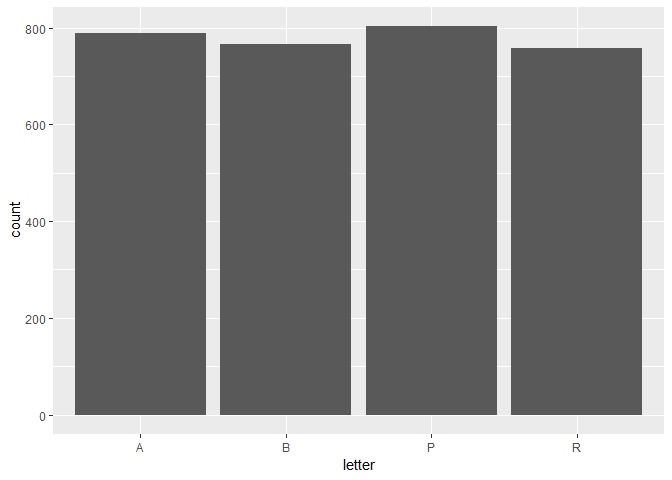
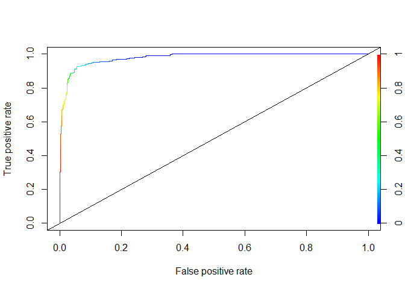
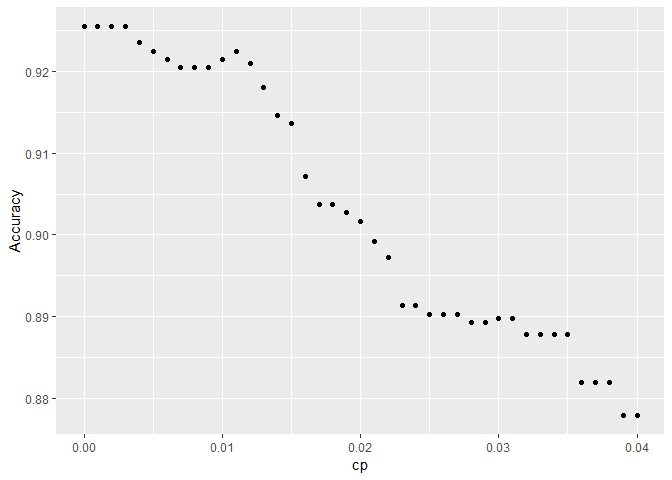
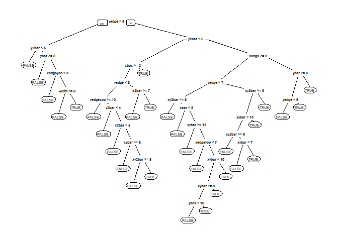
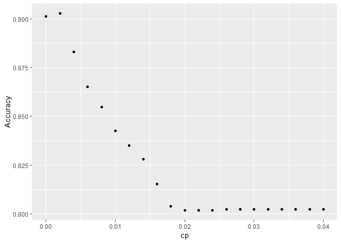
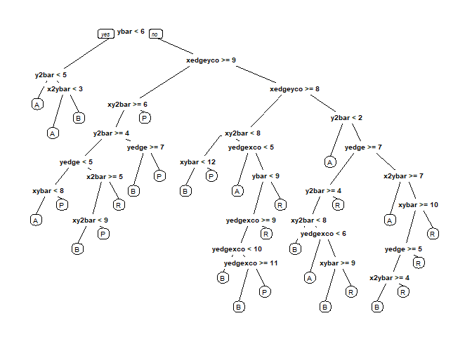
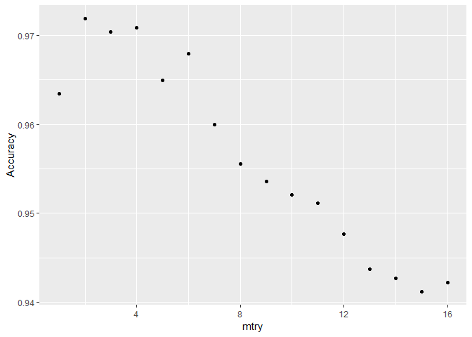

Letters Recognition
================
Ran Meng
February 25, 2019

``` r
setwd("C:/Ran/Berkeley/IEOR/242/Applications in Data Analysis")
library(dplyr)
library(ggplot2)
library(caTools) # splits
library(rpart) # CART
library(rpart.plot) # CART plotting
library(caret)
library(randomForest)
library(gbm)
library(ROCR)
```

Import datafile:

``` r
dat <- read.csv('Letters242.csv') 
```

a:
--

To study the data file we can learn the distribution of letters through a bar chart:

``` r
ggplot(data = dat, aes(x = letter)) + geom_bar()
```



``` r
pct_diff = (max(table(dat$letter)) - min(table(dat$letter))) / max(table(dat$letter))*100

cat("Percentage difference between highest count(P) and lowest count(R):", pct_diff, "%")
```

    ## Percentage difference between highest count(P) and lowest count(R): 5.603985 %

From the bar chart above, we see that the counts for each individual letter are similar. The least occurred letter R is only 5.6% less than the most occurred letter P. This means we have a balanced training set. A balanced training set is essential for a well-trained predictive model.

b:
--

To predict whether a letter is B or not, we have to create a new binary, factor variable:

``` r
dat$isB <- as.factor(dat$letter == 'B')
```

Prepare training & test sets:

``` r
set.seed(456)

train.ids = sample(nrow(dat), 0.65*nrow(dat))
dat.train = dat[train.ids,]
dat.test = dat[-train.ids,]
```

i: The accuracy of the baseline method on the test set is 0.750:

``` r
table(dat.test$isB)
```

    ## 
    ## FALSE  TRUE 
    ##   818   273

``` r
acc_base = 818/nrow(dat.test)
acc_base
```

    ## [1] 0.7497709

ii: Construct a logistic model and predict whether the letter is B:

``` r
set.seed(456)
mod_log <- glm(isB ~ xbox + ybox + width + height + onpix + 
                xbar + ybar + x2bar + y2bar + xybar + x2ybar    + xy2bar    + xedge + xedgeycor + yedge + yedgexcor, data = dat.train, family = "binomial")
summary(mod_log)
```

    ## 
    ## Call:
    ## glm(formula = isB ~ xbox + ybox + width + height + onpix + xbar + 
    ##     ybar + x2bar + y2bar + xybar + x2ybar + xy2bar + xedge + 
    ##     xedgeycor + yedge + yedgexcor, family = "binomial", data = dat.train)
    ## 
    ## Deviance Residuals: 
    ##     Min       1Q   Median       3Q      Max  
    ## -3.0714  -0.1499  -0.0161  -0.0001   3.5793  
    ## 
    ## Coefficients:
    ##              Estimate Std. Error z value Pr(>|z|)    
    ## (Intercept) -14.88193    2.51356  -5.921 3.21e-09 ***
    ## xbox         -0.02293    0.12293  -0.187  0.85202    
    ## ybox          0.05206    0.08737   0.596  0.55128    
    ## width        -1.16918    0.15238  -7.673 1.68e-14 ***
    ## height       -0.79658    0.14135  -5.635 1.75e-08 ***
    ## onpix         0.99377    0.13548   7.335 2.21e-13 ***
    ## xbar          0.55671    0.13065   4.261 2.03e-05 ***
    ## ybar         -0.58105    0.11959  -4.859 1.18e-06 ***
    ## x2bar        -0.39569    0.09547  -4.145 3.41e-05 ***
    ## y2bar         1.45044    0.13298  10.907  < 2e-16 ***
    ## xybar         0.25717    0.09448   2.722  0.00649 ** 
    ## x2ybar        0.49244    0.12493   3.942 8.09e-05 ***
    ## xy2bar       -0.48687    0.10804  -4.506 6.60e-06 ***
    ## xedge        -0.22309    0.09290  -2.401  0.01634 *  
    ## xedgeycor     0.13992    0.10308   1.357  0.17467    
    ## yedge         1.72478    0.12814  13.460  < 2e-16 ***
    ## yedgexcor     0.34488    0.07143   4.828 1.38e-06 ***
    ## ---
    ## Signif. codes:  0 '***' 0.001 '**' 0.01 '*' 0.05 '.' 0.1 ' ' 1
    ## 
    ## (Dispersion parameter for binomial family taken to be 1)
    ## 
    ##     Null deviance: 2247.88  on 2024  degrees of freedom
    ## Residual deviance:  639.64  on 2008  degrees of freedom
    ## AIC: 673.64
    ## 
    ## Number of Fisher Scoring iterations: 8

Construct confusion matrix and calculate accuracy with p = 0.5 we achieve an accuracy = 0.943:

``` r
predTestLog <- predict(mod_log, newdata=dat.test, type="response")

# Confusion matricies based on decision tree threshold 
CM <- table(dat.test$isB, predTestLog > 0.5)
CM
```

    ##        
    ##         FALSE TRUE
    ##   FALSE   792   26
    ##   TRUE     36  237

``` r
acc_log = (792+237)/nrow(dat.test)
acc_log
```

    ## [1] 0.9431714

iii: Compute AUC of logistic model and we get AUC = 0.978:

``` r
rocr.log.pred <- prediction(predTestLog, dat.test$isB)
logPerformance <- performance(rocr.log.pred, "tpr", "fpr")
plot(logPerformance, colorize = TRUE)
abline(0, 1)
```



``` r
AUC = as.numeric(performance(rocr.log.pred, "auc")@y.values)
AUC
```

    ## [1] 0.9784563

iv: Construct a CART model and predict whether the letter is B. I am trying to construct this CART model with cp = (0, 0.002, 0.004, ..., 0.04) and see which one is the best with a 10-fold cross validation. Depending on the results from cross validation evaluation, I may need to adjust the range of cp. I choose 10 as fold size because it is a good balance betweem variance and bias. If k is large, there will be less bias but higher correlation. In other words, LOOCV, an extreme case of high k, has more accurate estimates on average but the result is very dependent on the particular training set. I consider 10 as a good compromise and a suitable fold number for this cross-validation. I will pick the cp value with the highest accuracy through the 10-fold cv:

``` r
set.seed(456)
cpVals = data.frame(cp = seq(0, .04, by=.001))

mod_CART <- train(isB ~ xbox + ybox + width + height + onpix + xbar + ybar + x2bar + y2bar + xybar + x2ybar + xy2bar    + xedge + xedgeycor + yedge + yedgexcor, data = dat.train, method = "rpart", tuneGrid = cpVals, trControl = trainControl(method = "cv", number = 10), metric = "Accuracy")
  
mod_CART
```

    ## CART 
    ## 
    ## 2025 samples
    ##   16 predictor
    ##    2 classes: 'FALSE', 'TRUE' 
    ## 
    ## No pre-processing
    ## Resampling: Cross-Validated (10 fold) 
    ## Summary of sample sizes: 1822, 1823, 1822, 1823, 1823, 1822, ... 
    ## Resampling results across tuning parameters:
    ## 
    ##   cp     Accuracy   Kappa    
    ##   0.000  0.9254402  0.7964109
    ##   0.001  0.9254402  0.7964109
    ##   0.002  0.9254402  0.7964109
    ##   0.003  0.9254353  0.7972780
    ##   0.004  0.9234575  0.7903921
    ##   0.005  0.9224626  0.7869871
    ##   0.006  0.9214749  0.7830621
    ##   0.007  0.9204872  0.7805706
    ##   0.008  0.9204872  0.7805706
    ##   0.009  0.9204872  0.7805706
    ##   0.010  0.9214700  0.7826040
    ##   0.011  0.9224553  0.7850938
    ##   0.012  0.9209701  0.7796205
    ##   0.013  0.9179998  0.7699434
    ##   0.014  0.9145442  0.7568251
    ##   0.015  0.9135590  0.7532519
    ##   0.016  0.9071331  0.7350010
    ##   0.017  0.9036751  0.7228190
    ##   0.018  0.9036751  0.7228190
    ##   0.019  0.9026850  0.7203792
    ##   0.020  0.9016998  0.7186850
    ##   0.021  0.8992245  0.7107174
    ##   0.022  0.8972419  0.7044554
    ##   0.023  0.8913232  0.6845113
    ##   0.024  0.8913232  0.6845113
    ##   0.025  0.8903380  0.6811002
    ##   0.026  0.8903380  0.6811002
    ##   0.027  0.8903380  0.6811002
    ##   0.028  0.8893503  0.6764967
    ##   0.029  0.8893503  0.6764967
    ##   0.030  0.8898429  0.6773094
    ##   0.031  0.8898429  0.6773094
    ##   0.032  0.8878701  0.6716683
    ##   0.033  0.8878701  0.6716683
    ##   0.034  0.8878701  0.6716683
    ##   0.035  0.8878701  0.6716683
    ##   0.036  0.8819587  0.6505154
    ##   0.037  0.8819587  0.6505154
    ##   0.038  0.8819587  0.6505154
    ##   0.039  0.8779983  0.6359207
    ##   0.040  0.8779983  0.6359207
    ## 
    ## Accuracy was used to select the optimal model using the largest value.
    ## The final value used for the model was cp = 0.002.

``` r
mod_CART$results
```

    ##       cp  Accuracy     Kappa  AccuracySD    KappaSD
    ## 1  0.000 0.9254402 0.7964109 0.013412869 0.03607454
    ## 2  0.001 0.9254402 0.7964109 0.013412869 0.03607454
    ## 3  0.002 0.9254402 0.7964109 0.013412869 0.03607454
    ## 4  0.003 0.9254353 0.7972780 0.014235433 0.03809861
    ## 5  0.004 0.9234575 0.7903921 0.012583624 0.03388110
    ## 6  0.005 0.9224626 0.7869871 0.012377813 0.03144969
    ## 7  0.006 0.9214749 0.7830621 0.011089793 0.02755027
    ## 8  0.007 0.9204872 0.7805706 0.010330208 0.02566495
    ## 9  0.008 0.9204872 0.7805706 0.010330208 0.02566495
    ## 10 0.009 0.9204872 0.7805706 0.010330208 0.02566495
    ## 11 0.010 0.9214700 0.7826040 0.008959711 0.02281270
    ## 12 0.011 0.9224553 0.7850938 0.009452673 0.02369041
    ## 13 0.012 0.9209701 0.7796205 0.011771831 0.03094696
    ## 14 0.013 0.9179998 0.7699434 0.015098931 0.04384814
    ## 15 0.014 0.9145442 0.7568251 0.015436291 0.05041717
    ## 16 0.015 0.9135590 0.7532519 0.015628103 0.05118384
    ## 17 0.016 0.9071331 0.7350010 0.019617215 0.05254338
    ## 18 0.017 0.9036751 0.7228190 0.020895346 0.05557941
    ## 19 0.018 0.9036751 0.7228190 0.020895346 0.05557941
    ## 20 0.019 0.9026850 0.7203792 0.020749496 0.05511614
    ## 21 0.020 0.9016998 0.7186850 0.020128168 0.05366588
    ## 22 0.021 0.8992245 0.7107174 0.025173355 0.07623253
    ## 23 0.022 0.8972419 0.7044554 0.024607032 0.07507032
    ## 24 0.023 0.8913232 0.6845113 0.021917226 0.06690076
    ## 25 0.024 0.8913232 0.6845113 0.021917226 0.06690076
    ## 26 0.025 0.8903380 0.6811002 0.023325616 0.07396111
    ## 27 0.026 0.8903380 0.6811002 0.023325616 0.07396111
    ## 28 0.027 0.8903380 0.6811002 0.023325616 0.07396111
    ## 29 0.028 0.8893503 0.6764967 0.022905616 0.07232987
    ## 30 0.029 0.8893503 0.6764967 0.022905616 0.07232987
    ## 31 0.030 0.8898429 0.6773094 0.023245854 0.07285590
    ## 32 0.031 0.8898429 0.6773094 0.023245854 0.07285590
    ## 33 0.032 0.8878701 0.6716683 0.022408732 0.07006839
    ## 34 0.033 0.8878701 0.6716683 0.022408732 0.07006839
    ## 35 0.034 0.8878701 0.6716683 0.022408732 0.07006839
    ## 36 0.035 0.8878701 0.6716683 0.022408732 0.07006839
    ## 37 0.036 0.8819587 0.6505154 0.025939043 0.08230615
    ## 38 0.037 0.8819587 0.6505154 0.025939043 0.08230615
    ## 39 0.038 0.8819587 0.6505154 0.025939043 0.08230615
    ## 40 0.039 0.8779983 0.6359207 0.024872070 0.08015069
    ## 41 0.040 0.8779983 0.6359207 0.024872070 0.08015069

``` r
#Plot result
ggplot(mod_CART$results, aes(x=cp, y=Accuracy)) + geom_point()
```



Extract best model, we can see that cp = 0.002 returns us the best model with cross- validation. In addition, based on the plot that the accuracy decreases with the increase of cp, it is safe to say that high cp's result in underfitting. Running cross validation from cp = 0 to cp = 0.04 is sufficient to extract the best cp, which is 0.002.

``` r
mod_CART$bestTune
```

    ##      cp
    ## 3 0.002

``` r
mod_CART_best = mod_CART$finalModel
prp(mod_CART_best, digits=3)
```


Use the best model to make predictions. Since carat does not work with factors we need to manually create dummy variables:

``` r
dat.test.mm = as.data.frame(model.matrix(isB~.+0, data = dat.test))
predTestCART = predict(mod_CART_best, newdata = dat.test.mm, type="class")
table(dat.test$isB, predTestCART)
```

    ##        predTestCART
    ##         FALSE TRUE
    ##   FALSE   790   28
    ##   TRUE     39  234

``` r
acc_CART = (790 + 234)/ nrow(dat.test)
acc_CART
```

    ## [1] 0.9385885

The accuracy of my CART model is 0.939.

v: Construct a Random Forest model with default options and predict whether the letter is B:

``` r
set.seed(456)
mod_rf <- randomForest(isB ~ xbox + ybox + width + height + onpix + xbar + ybar + x2bar + y2bar + xybar + x2ybar    + xy2bar    + xedge + xedgeycor + yedge + yedgexcor, data = dat.train)
```

we obtain an accuracy = 0.976 for the RF:

``` r
predTestRF = predict(mod_rf, newdata = dat.test.mm, type="class")
table(dat.test$isB, predTestRF)
```

    ##        predTestRF
    ##         FALSE TRUE
    ##   FALSE   811    7
    ##   TRUE     19  254

``` r
acc_RF = (811+254)/nrow(dat.test)
acc_RF
```

    ## [1] 0.9761687

vi: Comparing accuracies:

``` r
cat("Logistic accuracy: ", acc_log)
```

    ## Logistic accuracy:  0.9431714

``` r
cat("\nCART accuracy: ", acc_CART)
```

    ## 
    ## CART accuracy:  0.9385885

``` r
cat("\nRandom Forest accuracy: ", acc_RF)
```

    ## 
    ## Random Forest accuracy:  0.9761687

The results indicate that *Random Forest* has the highest accuracy while *CART* is the most interpretable model because of its graphical display. Given the problem statement, our goal is to build the most accurate classification model. I would recommand *Random Forest* for this problem because I think accurate predictions/outcomes (accuracy) is more important than the process that derived this result(interpretability).

c:
--

i: The accuracy of the baseline method on the test set is 0.259 :

``` r
table(dat.test$letter)
```

    ## 
    ##   A   B   P   R 
    ## 264 273 283 271

``` r
acc_base2 = 283/nrow(dat.test)
acc_base2
```

    ## [1] 0.2593951

ii: Construct a CART model and predict the letter. I am trying to construct this CART model with cp = (0, 0.002, 0.004, ..., 0.04) and see which one is the best with a 10-fold cross validation. The reason I pick the same fold number and range of cp's to evaluate are identical with discussion in b) iv. I think 10 is a balanced CV fold number for bias and variance. The range of cp's (0 to 0.04) depends on the CV results but no matter what the final range is, I will pick the cp value with the highest accuracy through the 10-fold CV:

``` r
set.seed(456)
cpVals = data.frame(cp = seq(0, .04, by= .002))

mod_CART2 <- train(letter ~ xbox + ybox + width + height + onpix + xbar + ybar + x2bar + y2bar + xybar + x2ybar + xy2bar    + xedge + xedgeycor + yedge + yedgexcor, data = dat.train, method = "rpart", tuneGrid = cpVals, trControl = trainControl(method = "cv", number = 10), metric = "Accuracy")
                    
mod_CART2$results
```

    ##       cp  Accuracy     Kappa AccuracySD    KappaSD
    ## 1  0.000 0.9012503 0.8683055 0.02427028 0.03235250
    ## 2  0.002 0.9027159 0.8702808 0.02032860 0.02708741
    ## 3  0.004 0.8829769 0.8439699 0.02260094 0.03012805
    ## 4  0.006 0.8652014 0.8203135 0.01995768 0.02659526
    ## 5  0.008 0.8548541 0.8065462 0.02770557 0.03691914
    ## 6  0.010 0.8424875 0.7900409 0.02936796 0.03912013
    ## 7  0.012 0.8350885 0.7801883 0.02845211 0.03790468
    ## 8  0.014 0.8281308 0.7708013 0.01862454 0.02485594
    ## 9  0.016 0.8152960 0.7536483 0.02616553 0.03491792
    ## 10 0.018 0.8039464 0.7385168 0.02274776 0.03037596
    ## 11 0.020 0.8019662 0.7358473 0.02400452 0.03207715
    ## 12 0.022 0.8019662 0.7358473 0.02400452 0.03207715
    ## 13 0.024 0.8019662 0.7358333 0.02400452 0.03205411
    ## 14 0.026 0.8024588 0.7364636 0.02463107 0.03285852
    ## 15 0.028 0.8024588 0.7364636 0.02463107 0.03285852
    ## 16 0.030 0.8024588 0.7364636 0.02463107 0.03285852
    ## 17 0.032 0.8024588 0.7364636 0.02463107 0.03285852
    ## 18 0.034 0.8024588 0.7364636 0.02463107 0.03285852
    ## 19 0.036 0.8024588 0.7364636 0.02463107 0.03285852
    ## 20 0.038 0.8024588 0.7364636 0.02463107 0.03285852
    ## 21 0.040 0.8024588 0.7364636 0.02463107 0.03285852

``` r
#Plot result
ggplot(mod_CART2$results, aes(x=cp, y=Accuracy)) + geom_point()
```



We can see that cp = 0.002 returns us the best model with cross- validation. In addition, based on the plot that the accuracy decreases with the increase of cp and eventually reaches an asymptote, it is safe to say that high cp's result in underfitting. Running cross validation from cp = 0 to cp = 0.04 is sufficient to extract the best cp, which is 0.002:

``` r
mod_CART2$bestTune
```

    ##      cp
    ## 2 0.002

``` r
mod_CART2_best = mod_CART2$finalModel
prp(mod_CART2_best, digits=3)
```



Use the best model to make predictions. We get accuracy = 0.920 for the new CART model:

``` r
predTestCART2 = predict(mod_CART2_best, newdata = dat.test, type="class")
table(dat.test$letter, predTestCART2)
```

    ##    predTestCART2
    ##       A   B   P   R
    ##   A 256   4   1   3
    ##   B   1 242   7  23
    ##   P   2  12 268   1
    ##   R   2  29   2 238

``` r
acc_CART2 = (256 + 242 + 268 + 238)/ nrow(dat.test)
acc_CART2
```

    ## [1] 0.9202566

iii: Construct a Random Forest model with default options and predict the letter:

``` r
set.seed(456)
mod_rf2 <- randomForest(letter ~ xbox + ybox + width + height + onpix + xbar + ybar + x2bar + y2bar + xybar + x2ybar    + xy2bar    + xedge + xedgeycor + yedge + yedgexcor, data = dat.train)
```

we obtain an accuracy = 0.979 for the default RF:

``` r
predTestRF2 = predict(mod_rf2, newdata = dat.test, type="class")
table(dat.test$letter, predTestRF2)
```

    ##    predTestRF2
    ##       A   B   P   R
    ##   A 263   0   0   1
    ##   B   0 264   1   8
    ##   P   0   2 280   1
    ##   R   0  10   0 261

``` r
acc_RF2 = (263 + 264 + 280 + 261)/nrow(dat.test)
acc_RF2
```

    ## [1] 0.9789184

iv: Values of *mtry* ranges frrom 1 to p, where p = length(dat) -2 = 16 is the number of features in this problem. To select the best value of *mtry*, I attempted 5-fold, 7-fold, and 10-fold cross validation because I think the values provide good compromise between bias, variance and computation time. After experimentation, I choose 5-fold cross validation because it is the least computationally expensive. Performing Cross Validation an ensembled method like *Random Forest* is much more computationally demanding than performing CV on a single CART, so I opt for 5-fold CV instead of 10-fold CV in this case.

``` r
set.seed(456)
mod_rf3 <- train(letter ~ xbox + ybox + width + height + onpix + xbar + ybar + x2bar + y2bar + xybar + x2ybar   + xy2bar    + xedge + xedgeycor + yedge + yedgexcor, data = dat.train, method = "rf", tuneGrid = data.frame(mtry = 1: (length(dat) -2)), trControl = trainControl(method = "cv", number = 5), metric = "Accuracy")
                    
mod_rf3$results
```

    ##    mtry  Accuracy     Kappa  AccuracySD     KappaSD
    ## 1     1 0.9634567 0.9512728 0.007489411 0.009977979
    ## 2     2 0.9718542 0.9624666 0.010266582 0.013684996
    ## 3     3 0.9703703 0.9604865 0.010180532 0.013571019
    ## 4     4 0.9708629 0.9611421 0.010093008 0.013454763
    ## 5     5 0.9649406 0.9532452 0.010231668 0.013638114
    ## 6     6 0.9679036 0.9571968 0.012584849 0.016774064
    ## 7     7 0.9600011 0.9466563 0.019471293 0.025956838
    ## 8     8 0.9555579 0.9407308 0.019748578 0.026322692
    ## 9     9 0.9535862 0.9381016 0.016306206 0.021733514
    ## 10   10 0.9521011 0.9361183 0.015373140 0.020488320
    ## 11   11 0.9511159 0.9348092 0.019224537 0.025617759
    ## 12   12 0.9476579 0.9301972 0.019620269 0.026147301
    ## 13   13 0.9437072 0.9249258 0.019067357 0.025411141
    ## 14   14 0.9427196 0.9236100 0.020898144 0.027847229
    ## 15   15 0.9412405 0.9216373 0.021106497 0.028124887
    ## 16   16 0.9422245 0.9229480 0.019006752 0.025325221

``` r
#Plot result
ggplot(mod_rf3$results, aes(x = mtry, y = Accuracy)) + geom_point()
```



Extract best model, we can see that mtry = 2 returns us the best model with 5-fold cross- validation:

``` r
mod_rf3$bestTune
```

    ##   mtry
    ## 2    2

``` r
mod_rf3_best = mod_rf3$finalModel
```

Use the best model with mtry = 2 to make predictions:

``` r
predTestRF3 = predict(mod_rf3_best, newdata = dat.test, type="class")
table(dat.test$letter, predTestRF3)
```

    ##    predTestRF3
    ##       A   B   P   R
    ##   A 263   0   0   1
    ##   B   0 264   0   9
    ##   P   0   2 280   1
    ##   R   0   7   0 264

``` r
acc_RF3 = (263 + 264 + 280 + 264)/ nrow(dat.test)
acc_RF3
```

    ## [1] 0.9816682

From the result above, We get accuracy = 0.982 for the new RF model. The new RF model employs mtry = 2 from 5-fold cross validation as discussed above. According to [official R documentation](https://www.rdocumentation.org/packages/randomForest/versions/4.6-14/topics/randomForest), the default mtry parameter is sqrt(p) for a classification task. This means mtry = 4 for part (iii) and mtry = 2 for part (iv). 

v: Train boosting model with depth = 10 and itr = 3300:

``` r
set.seed(456)
mod_boost = gbm(letter ~ xbox + ybox + width + height + onpix + xbar + ybar + x2bar + y2bar + xybar + x2ybar    + xy2bar    + xedge + xedgeycor + yedge + yedgexcor, data = dat.train, distribution = "multinomial", interaction.depth = 10, n.trees = 3300)
```

Make predictions and we get accuracy = 0.981 for the boosting model:

``` r
predTestBoost <- predict(mod_boost, newdata = dat.test, n.trees = 3300, type = "response")
predTestBoost <- apply(predTestBoost, 1, which.max)
predTestBoost <- factor(predTestBoost, level = c(1,2,3,4), labels = c("A", "B", "P", "R"))

table(dat.test$letter, predTestBoost)
```

    ##    predTestBoost
    ##       A   B   P   R
    ##   A 262   0   1   1
    ##   B   1 263   1   8
    ##   P   0   1 280   2
    ##   R   0   6   0 265

``` r
acc_boost = (262 + 263 + 280 + 265)/nrow(dat.test)
acc_boost
```

    ## [1] 0.9807516

vi: Comparing accuracies:

``` r
cat("CART accuracy: ", acc_CART2)
```

    ## CART accuracy:  0.9202566

``` r
cat("\nRandom Forest accuracy with default parameters: ", acc_RF2)
```

    ## 
    ## Random Forest accuracy with default parameters:  0.9789184

``` r
cat("\nRandom Forest accuracy with cross validation on values of mtry: ", acc_RF3)
```

    ## 
    ## Random Forest accuracy with cross validation on values of mtry:  0.9816682

``` r
cat("\nBoosting model accuracy: ", acc_boost)
```

    ## 
    ## Boosting model accuracy:  0.9807516

Based on the accuracies, we can observe that ensemble methods including *Random Forests* and *Boosting* return higher accuracies than CART. Performing a cross validation to select the best mtry value on *Random Forests* improves its accuracy. There is no signifcant difference between the performance of *Boosting* and *Random Forests*. Based on the accuracies for this test data alone, I would pick *Random Forests* calibrated with the best mtry value. In other words, I would pick *Random Forests* both in part (b) and part (c) because of its high accuracies on the test set and I do not consider interpretability an important aspect for this problem.
However, it is worth noting that performances on this single test set are not the best indications of the models' performances. We could perform bootstraping on the testsets to get OSR<sup>2</sup> and confidence intervals to better assess the models' performances.
