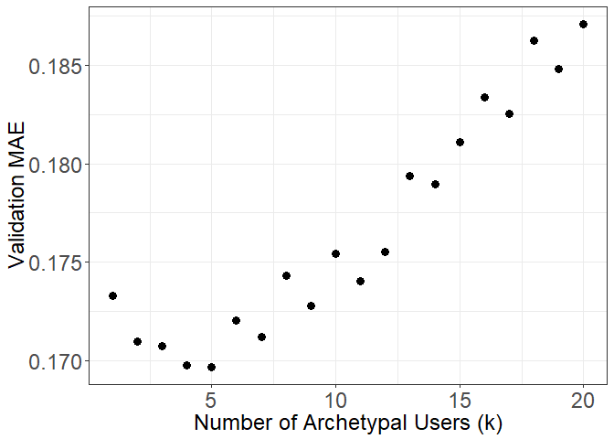
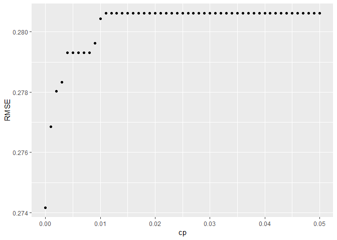

Songs Recommendation
================
Ran Meng
April 4, 2019

Load packages:

``` r
library(softImpute)
library(randomForest)
library(ranger)
library(dplyr)
library(tidyverse)
library(reshape2)
library(caret)
```

1.
--

#### a:

Load dataset:

``` r
MusicRatings <- read.csv("MusicRatings.csv")
Songs <- read.csv("Songs.csv")
Users <- read.csv("Users.csv")

cat("Number of songs: ", length(Songs$songID))
```

    ## Number of songs:  807

``` r
cat("\nNumber of users: ", length(Users$userID))
```

    ## 
    ## Number of users:  2421

``` r
range = max(MusicRatings$rating) - min(MusicRatings$rating)
cat("\nRange of ratings", range)
```

    ## 
    ## Range of ratings 2.432969

Construct training, valA, valB and testing set:

``` r
set.seed(500)
train.ids <- sample(nrow(MusicRatings), 0.92*nrow(MusicRatings))
train <- MusicRatings[train.ids,]
test <- MusicRatings[-train.ids,]

val1.ids <- sample(nrow(train), (4/92)*nrow(train))
val1 <- train[val1.ids,]
train <- train[-val1.ids,]

val2.ids <- sample(nrow(train), (4/88)*nrow(train))
val2 <- train[val2.ids,]
train <- train[-val2.ids,]

cat('Training data size:', dim(train))
```

    ## Training data size: 243104 3

``` r
cat('Validation set A size:', dim(val1))
```

    ## Validation set A size: 11576 3

``` r
cat('Validation set B size:', dim(val2))
```

    ## Validation set B size: 11576 3

``` r
cat('Testing data size:', dim(test))
```

    ## Testing data size: 23153 3

Construct incomplete training set rating matrix:

``` r
mat.train <- Incomplete(train$userID, train$songID, train$rating)
head(summary(mat.train), 10)
```

    ## 2421 x 807 sparse Matrix of class "Incomplete", with 243104 entries 
    ##     i j        x
    ## 1   7 1 1.477121
    ## 2   8 1 1.301030
    ## 3  16 1 1.000000
    ## 4  33 1 1.000000
    ## 5  48 1 1.000000
    ## 6  55 1 1.000000
    ## 7  69 1 1.477121
    ## 8  76 1 1.000000
    ## 9  94 1 1.000000
    ## 10 96 1 2.255273

#### b:

i: The total number of parameters is the sum of number of users (n) and number of songs(m), or **n+m**. The total number of observations is the number of observations in training dataset:

``` r
cat("Total number of parameters included: " , length(Songs$songID) + length(Users$userID))
```

    ## Total number of parameters included:  3228

``` r
cat("\nTotal number of observations we have: ", length(train$rating))
```

    ## 
    ## Total number of observations we have:  243104

Use biscale() to fit model:

``` r
set.seed(500)
mat.train.centered <- biScale(mat.train, maxit = 1000, row.scale = FALSE, col.scale = FALSE)
head(summary(mat.train.centered), 10)
```

    ## 2421 x 807 sparse Matrix of class "Incomplete", with 243104 entries 
    ##     i j            x
    ## 1   7 1  0.311775968
    ## 2   8 1  0.121260085
    ## 3  16 1  0.040743840
    ## 4  33 1 -0.002110074
    ## 5  48 1 -0.024044045
    ## 6  55 1 -0.017097587
    ## 7  69 1  0.500860747
    ## 8  76 1 -0.023976084
    ## 9  94 1 -0.122062973
    ## 10 96 1  1.012647726

ii:

``` r
alpha <- attr(mat.train.centered, "biScale:row")$center #Length: 2421
beta <- attr(mat.train.centered, "biScale:column")$center #Length: 807

Users$alpha <- alpha
Songs$beta <- beta

head(Users)
```

    ##   userID       alpha
    ## 1      1  0.13818314
    ## 2      2  0.22077309
    ## 3      3 -0.07239196
    ## 4      4 -0.10679671
    ## 5      5  0.21579155
    ## 6      6 -0.02263859

``` r
head(Songs)
```

    ##   songID               songName year             artist genre     beta
    ## 1      1   Aunt Eggma Blowtorch 1995 Neutral Milk Hotel  Rock 1.056437
    ## 2      2  Back Against The Wall 2008  Cage The Elephant  Rock 1.173460
    ## 3      3                   Halo 2008 The Pussycat Dolls   Pop 1.261149
    ## 4      4 The Canals Of Our City 2005             Beirut  Rock 1.094521
    ## 5      5            Full Circle 2008        Miley Cyrus   Pop 1.176196
    ## 6      6            Combat Rock 2002     Sleater-kinney  Rock 1.067406

3 popular songs after removing bias are songs corresponding to 3 highest *β*<sub>*j*</sub>:

``` r
idx <- order(Songs$beta, decreasing = TRUE)[1:3]

top_3_songs <- data.frame(ID = Songs$songID[idx], Name = Songs$songName[idx], Artist = Songs$artist[idx])

top_3_songs
```

    ##    ID           Name        Artist
    ## 1  54 You're The One Dwight Yoakam
    ## 2  26           Undo         Bjork
    ## 3 439        Secrets   OneRepublic

By inspecting model 1:

*X*<sub>*i*, *j*</sub> = *α*<sub>*i*</sub> + *β*<sub>*j*</sub> + *ϵ*<sub>*i*, *j*</sub>

We can observe that the user's affinity of giving high(low) score, *α*<sub>*i*</sub>, is separated from the overall quality of movie, *β*<sub>*j*</sub>. This means *α*<sub>*i*</sub> and *β*<sub>*j*</sub> differ from the mean scores of the observed ratings in the way that they do not include the bias from one another. Thus, the 3 most popular songs after removing the bias due to the users' affinity for ratings correspond to the 3 highest *β*<sub>*j*</sub>s.

iii: 3 users that are most are the most enthused about songs after removing for the bias due to the effect of the popularity of songs correspond to the 3 highest *α*<sub>*i*</sub>:

``` r
idx <- order(Users$alpha, decreasing = TRUE)[1:3]

top_3_users <- data.frame(ID = Users$userID[idx])

top_3_users
```

    ##     ID
    ## 1 1540
    ## 2 1569
    ## 3  838

iv: Out-of-sample performance of the fitted model on the previously constructed test set:

``` r
pred_lm = alpha[test$userID] + beta[test$songID]
MAE_lm =  mean(abs(test$rating - pred_lm))/range
RMSE_lm = sqrt(mean((test$rating - pred_lm)^2))/range

OSR2 <- function(predictions, train, test) {
  SSE <- sum((test - predictions)^2)
  SST <- sum((test - mean(train))^2)
  r2 <- 1 - SSE/SST
  return(r2)
}
OSR2_lm = OSR2(pred_lm, train$rating, test$rating)

cat("MAE for linear model: ", MAE_lm)
```

    ## MAE for linear model:  0.07434344

``` r
cat("\nRMSE for linear model: ", RMSE_lm)
```

    ## 
    ## RMSE for linear model:  0.09707992

``` r
cat("\nOSR2 for linear model: ", OSR2_lm)
```

    ## 
    ## OSR2 for linear model:  0.278539

#### c:

i:

The number of parameters in Z can be calculated separately with W and S. W is the user weight matrix with dimension n x k and S is the archetype rating matrix with k x m. Thus the total number of parameters is n x k + k x m = k(n+m).

Adding the number of parameters for *α*<sub>*i*</sub> and *β*<sub>*j*</sub>, the number of **total parameters** is: *k* ⋅ (*n* + *m*)+*n* + *m* = 2421 ⋅ *k* + *k* ⋅ 807 + 2421 + 807 = 3228 ⋅ (*k* + 1)

Total number of training observations is still **243104**, the size of training dataset.

ii:

Let us begin by selecting a CF model with varying k that returns the lowest MAE:

``` r
mae.vals = rep(NA, 20)
for (rnk in seq_len(20)) {
  mod <- softImpute(mat.train.centered, rank.max = rnk, lambda = 0, maxit = 1000) #train CF model
  preds <- impute(mod, val1$userID, val1$songID) %>% pmin(max(MusicRatings$rating)) %>% pmax(min(MusicRatings$rating)) # Shrink(raise) to the proper scale of rating
  
  mae.vals[rnk] <- mean(abs(preds - val1$rating))
}
```

``` r
mae.val.df <- data.frame(rnk = seq_len(20), mae = mae.vals)
ggplot(mae.val.df, aes(x = rnk, y = mae)) + geom_point(size = 3) + 
  ylab("Validation MAE") + xlab("Number of Archetypal Users (k)") + 
  theme_bw() + theme(axis.title=element_text(size=18), axis.text=element_text(size=18))
```



``` r
cat("Best K:", which.min(mae.vals))
```

    ## Best K: 5

By plotting K vs validation MAE, we can observe that k = 5 returns us the smallest MAE and therefore I will use k = 5 to build my final collaborative filtering model:

``` r
set.seed(500)
mod_low_rank <- softImpute(mat.train.centered, rank.max = 5, lambda = 0, maxit = 1000)
```

iii:

Let us blend the low rank model and the linear addictive model and apply it on the test set:

``` r
val.preds.cf <- impute(mod_low_rank, val2$userID, val2$songID)
val.preds.lm <- alpha[val2$userID] + beta[val2$songID]

val.blending_df = data.frame(rating = val2$rating, cf_preds = val.preds.cf, 
                             lm_preds = val.preds.lm)


# Train blended model
blend.mod = lm(rating ~ . -1, data = val.blending_df)

test.preds.cf <- impute(mod_low_rank, test$userID, test$songID)
test.preds.lm <- alpha[test$userID] + beta[test$songID]

test.blending_df = data.frame(rating = test$rating, cf_preds = test.preds.cf, 
                              lm_preds = test.preds.lm)

test.preds.blend <- predict(blend.mod, newdata = test.blending_df)

MAE_blend = mean(abs(test.preds.blend - test$rating))/range
RMSE_blend = sqrt(mean((test.preds.blend - test$rating)^2))/range
OSR2_blend = OSR2(test.preds.blend, train$rating, test$rating)

cat("MAE for 1st blended model: ", MAE_blend)
```

    ## MAE for 1st blended model:  0.07117447

``` r
cat("\nRMSE for 1st blended model: ", RMSE_blend)
```

    ## 
    ## RMSE for 1st blended model:  0.0938636

``` r
cat("\nOSR2 for 1st blended model: ", OSR2_blend)
```

    ## 
    ## OSR2 for 1st blended model:  0.325552

Summary of the collaborative filtering model compared to the simple addictive model:

``` r
result <- data.frame(addictive = c(MAE_lm, RMSE_lm, OSR2_lm), CF = c(MAE_blend, RMSE_blend, OSR2_blend))
row.names(result) <- c("MAE", "RMSE", "OSR2")
result
```

    ##       addictive         CF
    ## MAE  0.07434344 0.07117447
    ## RMSE 0.09707992 0.09386360
    ## OSR2 0.27853903 0.32555201

#### d:

i: The first model I will build is the default RF model because it is considered as a robust ensemble method that performs well in general:

``` r
train_merge <- merge(train, Songs, by = 'songID')
train_merge$year <- as.factor(train_merge$year)
train_merge$genre <- as.factor(train_merge$genre)

val2_merge <- merge(val2, Songs, by = 'songID')
val2_merge$year <- as.factor(val2_merge$year)
val2_merge$genre <- as.factor(val2_merge$genre)


test_merge <- merge(test, Songs, by = 'songID')
test_merge$year <- as.factor(test_merge$year)
test_merge$genre <- as.factor(test_merge$genre)
```

``` r
set.seed(500)
rf.mod <- ranger(rating ~ year + genre, 
                 data = train_merge, 
                 num.trees = 500,
                 verbose = FALSE)
```

``` r
preds.rf <- predict(rf.mod, data = test_merge)
preds.rf <- preds.rf$predictions
MAE_rf = mean(abs(preds.rf - test_merge$rating))/range
RMSE_rf = sqrt(mean((preds.rf - test_merge$rating)^2))/range
OSR2_rf = OSR2(preds.rf, train_merge$rating, test_merge$rating)

cat("MAE for RF model: ", MAE_rf)
```

    ## MAE for RF model:  0.09229339

``` r
cat("\nRMSE for RF model: ", RMSE_rf)
```

    ## 
    ## RMSE for RF model:  0.112388

``` r
cat("\nOSR2 for RF model: ", OSR2_rf)
```

    ## 
    ## OSR2 for RF model:  0.03307197

The second model I will build is a CART model with 5- fold CV on different cp values. I will pick the best cp value from the CART with the lowest RMSE:

``` r
set.seed(500)
CART.mod <- train(rating ~ year + genre,
                     data = train_merge,
                     method = "rpart",
                     tuneGrid = data.frame(cp=seq(0, 0.05, 0.001)),
                     trControl = trainControl(method="cv", number = 5), 
                     metric = "RMSE"
                     )
```

``` r
ggplot(CART.mod$results, aes(x=cp, y= RMSE)) + geom_point()
```



``` r
val2_merge_mm = as.data.frame(model.matrix(rating ~ . + 0, data=val2_merge))
test_merge_mm = as.data.frame(model.matrix(rating ~ . + 0, data=test_merge))

preds.CART <- predict(CART.mod$finalModel, newdata = test_merge_mm)

MAE_CART = mean(abs(preds.CART - test_merge$rating))/range
RMSE_CART = sqrt(mean((preds.CART - test_merge$rating)^2))/range
OSR2_CART = OSR2(preds.CART, train_merge$rating, test_merge$rating)

cat("MAE for CART model: ", MAE_CART)
```

    ## MAE for CART model:  0.09129548

``` r
cat("\nRMSE for CART model: ", RMSE_CART)
```

    ## 
    ## RMSE for CART model:  0.1119073

``` r
cat("\nOSR2 for CART model: ", OSR2_CART)
```

    ## 
    ## OSR2 for CART model:  0.04132678

Based on the cp vs RMSE plot above and the OSR<sup>2</sup> value, we may infer that the CART model is underfitting because the model performs the best without pruning but its OSR<sup>2</sup> is still low. Therefore the best solution could be an ensembled method consisting of all the based models, as suggested by next section.

ii:

``` r
val.preds.cf <- impute(mod_low_rank, val2$userID, val2$songID)
val.preds.lm <- alpha[val2$userID] + beta[val2$songID]
val.preds.rf <- predict(rf.mod, data = val2_merge)$predictions
val.preds.CART <- predict(CART.mod$finalModel, newdata = val2_merge_mm)
val.final_df = data.frame(rating = val2$rating, cf_preds = val.preds.cf, 
                             lm_preds = val.preds.lm, rf_preds = val.preds.rf, CART_preds = val.preds.CART)


# Train blended model
final.mod = lm(rating ~ . -1, data = val.final_df)

test.preds.cf <- impute(mod_low_rank, test$userID, test$songID)
test.preds.lm <- alpha[test$userID] + beta[test$songID]
test.preds.rf <- preds.rf
test.preds.CART <- preds.CART

test.final_df = data.frame(rating = test$rating, cf_preds = test.preds.cf, 
                              lm_preds = test.preds.lm, rf_preds = test.preds.rf, CART_preds = test.preds.CART)

test.preds.final <- predict(final.mod, newdata = test.final_df)

MAE_final = mean(abs(test.preds.final - test$rating))/range
RMSE_final = sqrt(mean((test.preds.final - test$rating)^2))/range
OSR2_final = OSR2(test.preds.final, train$rating, test$rating)

cat("MAE for final model: ", MAE_final)
```

    ## MAE for final model:  0.07166032

``` r
cat("\nRMSE for final model: ", RMSE_final)
```

    ## 
    ## RMSE for final model:  0.09378297

``` r
cat("\nOSR2 for final model: ", OSR2_final)
```

    ## 
    ## OSR2 for final model:  0.3267103

Summarizing the results of all models:

``` r
result$final = c(MAE_final, RMSE_final, OSR2_final)
result
```

    ##       addictive         CF      final
    ## MAE  0.07434344 0.07117447 0.07166032
    ## RMSE 0.09707992 0.09386360 0.09378297
    ## OSR2 0.27853903 0.32555201 0.32671028

By looking at the OSR<sup>2</sup> of the 2 individual models built in part i) above, and the summary table of the performance metrics, we observe that the 2 models trained on *year* and *genre* do not add signifiant predictive power on top of the collaborative filtering model because the OSR<sup>2</sup> of the 2 individual models are basically 0 and the OSR<sup>2</sup> of the final model is approximately the same as that of the CF model.
